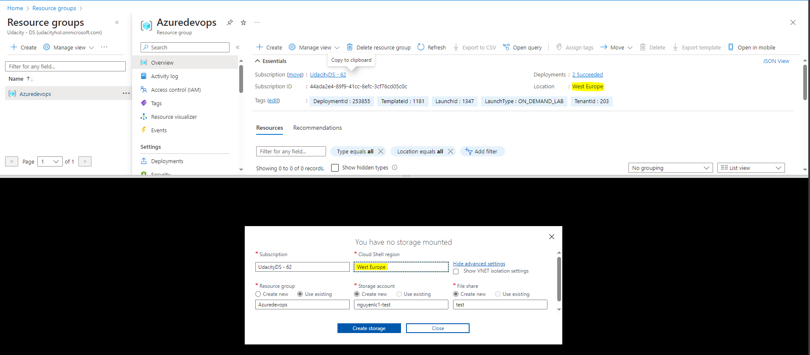
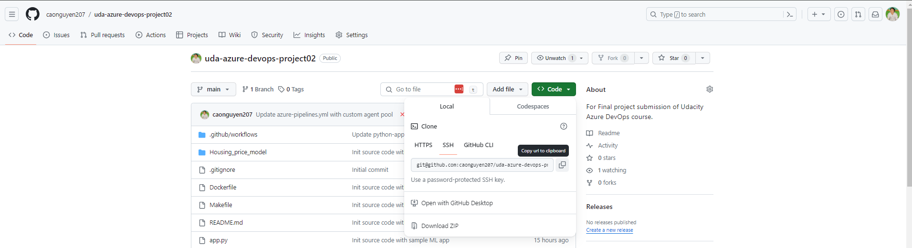
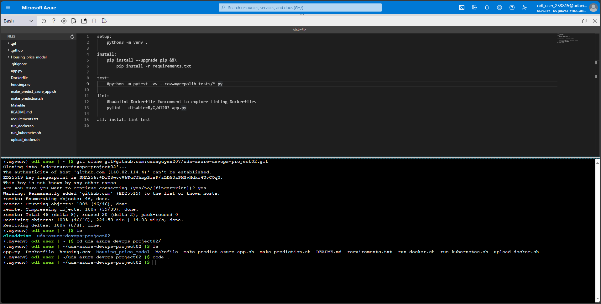
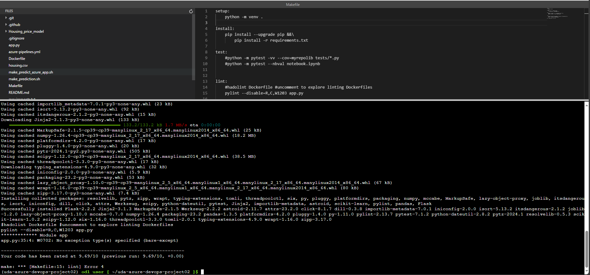
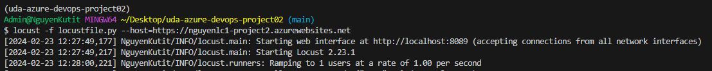
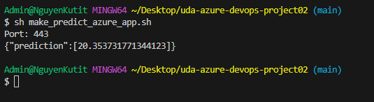
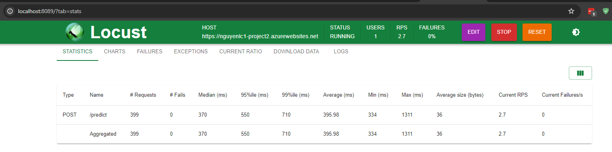

[](https://github.com/caonguyen207/uda-azure-devops-project02/actions/workflows/python-app.yml)

# Overview

By this repository, you will learn how to use Azure pipeline to deploy sample Machine Learning application in Azure App Service. The architecture can be found by below image:


## Project Plan

<TODO: Project Plan

* A link to a Trello board for the project
* A link to a spreadsheet that includes the original and final project plan>

## Getting Started

### For local cloud shell and desktop testing

1. Create new Storage Account with unique name in same region with existing resource group.



2. Follow instruction at [adding-a-new-ssh-key-to-your-github-account](https://docs.github.com/en/authentication/connecting-to-github-with-ssh/adding-a-new-ssh-key-to-your-github-account) and add public key to your Git Hub Account.
3. Clone the repo into Cloud Shell use SSH URL.



* The result should be as below



4. In cloud shell, run `make all`



5. Run the command `sh commands.sh` to create agent to run Auzre pipeline and App Service.

6. Clone the repo into local laptop/desktop (use either HTTPs or SSH)

7. Verify project running on Azure App Service


* By browser:


* By CMD:


* Output of streamed log files from deployed application


8. Run below command (you can change the command based on your OS, for my case is Window)

```python
python -m venv .
source Scipts/active
python.exe -m pip install --upgrade pip
pip install --upgrade pip && pip install -r requirements.txt
```

9. Start `locust` in your local environment by running command: `locust -f locustfile.py --host=https://nguyenlc1-project2.azurewebsites.net`. The result should be as below.



10. Open another terminal, navigate to repo folder and run:  `sh make_predict_azure_app.sh`. The result should be as below.



11. Open browser and paste: `http://localhost:8089/?tab=stats`, it should display testing result as below:



### Set-up new Azure DevOps pipeline and integrate with your public repo

1. Navigate to browser that now logged in with Azure account.
2. Open new tab and paste `https://aex.dev.azure.com/`
3. Follow instruction and create new DevOps Organization and also project.
4. Set up their own self-hosted agent(opens in a new tab) that will build and deploy the code by clicking on "Project settings" on bottom-left conner.
5. Create a Personal Access Token (PAT) by clicking on the top-right user icon, select "Full access" and store the token somewhere in your desktop.
6. Select  "Agent pools" and create new pool named `mypool` as "Self-hosted".
7. Open "Virtual machine" and search by VM name.
8. Copy Public IP address
9. Execute `ssh devopsagent@<IP_in_Step_6>`. Typing `DevOpsAgent@123` as password (Please note that password will not show during keyin time)
*Install docker in the agent.

```shell
sudo snap install docker
sudo groupadd docker
sudo usermod -aG docker $USER
```

* Configure the Agent (VM) - Install Agent Services
11. Add Environment

* Passing tests that are displayed after running the `make all` command from the `Makefile`


* Successful deploy of the project in Azure Pipelines.  [Note the official documentation should be referred to and double checked as you setup CI/CD](https://docs.microsoft.com/en-us/azure/devops/pipelines/ecosystems/python-webapp?view=azure-devops).

* Running Azure App Service from Azure Pipelines automatic deployment

>

## Enhancements

<TODO: A short description of how to improve the project in the future>

## Demo

<TODO: Add link Screencast on YouTube>
